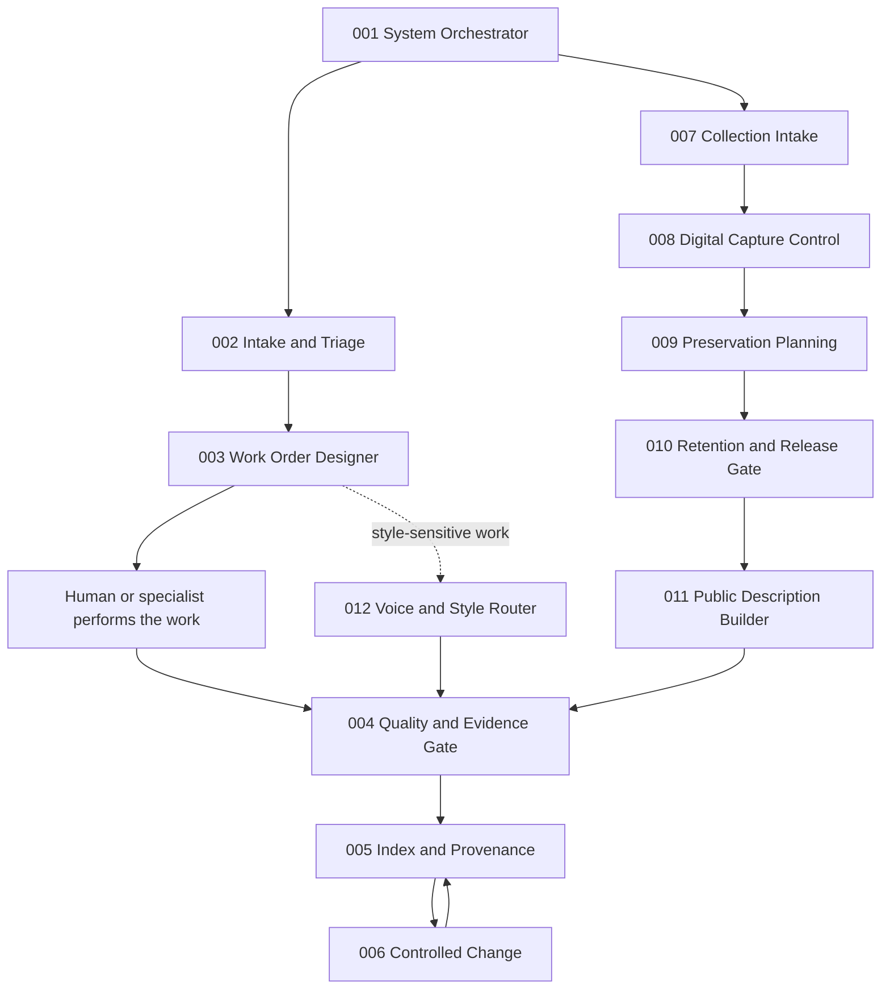

# Human-Gated Agent System

**A document-first reference architecture for coordinating twelve narrow artificial-intelligence agents while keeping consequential authority with a human operator.**

Public reference edition: **version 1.0**

This repository is not an autonomous-agent demonstration. It is an operating system for controlled collaboration: raw material is captured, work is defined, outputs are checked, accepted artifacts are indexed, and changes to the system are proposed through reviewable patches.

Every agent has:

- one primary job;
- a defined input;
- a structured output;
- explicit stop conditions;
- a named downstream handoff;
- a gate that determines what requires human review or authorization.

The system is model-agnostic. The Markdown prompts can be used with a hosted language model, a local model, or a human operator. The included Python package validates records and exposes the agent registry; it does **not** call a model, publish content, modify external systems, spend money, send messages, move files, or delete data.

## What problem this solves

Agent systems often fail in ordinary, preventable ways:

- a loose request becomes work before anyone defines the deliverable;
- one agent silently expands its role;
- polished language is mistaken for evidence;
- recommendations are treated as approval;
- files, versions, and source records lose their relationship;
- a workflow performs an external action because nobody defined a stopping point;
- repeated failures produce more prompting instead of a controlled system change.

This architecture separates those concerns. It treats artificial intelligence as a bounded labour and synthesis layer, not as the final authority.

## System at a glance



Not every run requires every agent. A clear low-risk task may begin with Agent 003. Existing output may go directly to Agent 004. Agent 006 is used only when evidence shows that the system itself needs to change.

## The twelve agents

| Agent | Public role | Primary responsibility | Primary output |
| --- | --- | --- | --- |
| 001 | System Orchestrator | Select the route, gate, and next bounded action | Dispatch record |
| 002 | Intake and Triage | Convert loose material into a bounded intake | Intake card |
| 003 | Work Order Designer | Define one executable deliverable and acceptance criteria | Work order |
| 004 | Quality and Evidence Gate | Compare output with the order, evidence, and risk rules | Review decision and repair list |
| 005 | Index and Provenance Recorder | Record identity, status, version, location, and source chain | Index update packet |
| 006 | Controlled Change Agent | Propose small reviewable changes to rules or templates | Patch proposal |
| 007 | Collection Intake | Identify and record one physical object | Object record |
| 008 | Digital Capture Control | Define and verify the capture record | Capture record |
| 009 | Preservation Planning | Record storage, handling, and preservation requirements | Storage and handling plan |
| 010 | Retention and Release Gate | Decide whether preparation, retention, or release may proceed | Controlled disposition decision |
| 011 | Public Description Builder | Draft factual public copy after the release gate opens | Public-copy draft |
| 012 | Voice and Style Router | Apply a permitted style profile without changing factual authority | Routed, style-checked text |

Agents 001–006 form the universal control loop. Agents 007–011 are an optional collection-management branch showing how specialist work can plug into the same control structure. Agent 012 is a cross-cutting service for style-sensitive work and public/private boundaries.

## The normal operating flow

1. **Dispatch:** Agent 001 identifies the class of problem, chooses the next agent, assigns a gate, and records prohibited actions.
2. **Intake:** Agent 002 captures purpose, source material, uncertainty, risk, audience, and immediate next steps.
3. **Definition:** Agent 003 creates one work order with a primary deliverable, constraints, and testable acceptance criteria.
4. **Execution:** A human, model, specialist, or tool performs the bounded work.
5. **Review:** Agent 004 checks the output against the work order, available evidence, and risk rules. It separates blocking defects from optional improvements.
6. **Acceptance:** A human decides whether the artifact is accepted, rejected, repaired, or held.
7. **Record:** Agent 005 records status, version, provenance, and the accepted artifact’s relationship to the system.
8. **Controlled improvement:** When repeated evidence shows a rule or template is defective, Agent 006 proposes a patch. The active system does not change until a human approves it.

The central handoff rule is simple:

> One agent must finish its bounded job before the next agent claims the material.

## Gate levels

| Gate | Meaning |
| --- | --- |
| `INTERNAL` | Read, classify, draft, inspect, or recommend without changing an external system. |
| `REVIEW` | A human must confirm the record or artifact before downstream work proceeds. |
| `ACTION` | A human must explicitly authorize the exact external, destructive, financial, privacy-sensitive, or public action. |
| `BLOCKED` | The public reference system must not automate or authorize the action. |

Approval is specific to one action and one target.

- Approval to draft is not approval to publish.
- Approval to recommend a file move is not approval to move the file.
- Approval to prepare a public description is not approval to release the underlying object.
- Approval in one run does not become permanent standing permission.

## Design invariants

These rules define the architecture more strongly than any individual prompt:

- One agent, one primary job.
- One record, one stable identifier.
- Unknown information remains unknown.
- Evidence, inference, and recommendation are not interchangeable.
- A recommendation is not approval.
- A polished result is not automatically a correct result.
- External action requires explicit, target-specific authorization.
- Source artifacts are never silently overwritten.
- Accepted changes preserve a provenance trail and rollback path.
- Human responsibility cannot be transferred to a fluent output.

## Quick start

### Use the documents without installing anything

1. Read [Architecture](docs/architecture.md) and [Governance and Gates](docs/governance-and-gates.md).
2. Open `agents/001-system-orchestrator/prompt.md`.
3. Supply a fictional or properly sanitized task.
4. Use `shared/templates/handoff-envelope.json` when passing work between agents.
5. Stop when the assigned gate requires human review or action.

For a complete fictional walkthrough, see [Quick Start](docs/quickstart.md).

### Install the local validation utility

Requirements:

- Python 3.10 or newer;
- no third-party runtime dependencies.

From the repository root:

```bash
python -m pip install -e .
```

Then inspect the registry or validate a record:

```bash
public-agent-system list
public-agent-system show 004
public-agent-system validate examples/sample-handoff.json
```

You can also run the package without installation:

```bash
PYTHONPATH=src python -m public_agent_system list
PYTHONPATH=src python -m public_agent_system show 004
PYTHONPATH=src python -m public_agent_system validate examples/sample-handoff.json
```

The validator checks structure. It cannot establish that content is true, lawful, safe, complete, or approved.

## Testing and repository checks

Run the unit tests:

```bash
python -m unittest discover -s tests -v
```

Run the repository-level structural checks:

```bash
python scripts/repository_check.py
```

The checks are intended to catch missing files, broken registry relationships, malformed records, and repository drift. They do not replace human review of real-world content or decisions.

## Repository map

| Path | Purpose |
| --- | --- |
| `agents/` | The twelve public agent specifications, prompts, and record templates |
| `docs/architecture.md` | System topology, universal loop, specialist branch, and invariants |
| `docs/quickstart.md` | A fictional end-to-end walkthrough |
| `docs/governance-and-gates.md` | Authority, approval, and stopping rules |
| `docs/handoff-contract.md` | Rules for passing bounded records between agents |
| `docs/customization.md` | Safe adaptation guidance |
| `docs/sanitization-boundary.md` | What was deliberately excluded from the public rebuild |
| `docs/publication-checklist.md` | Final checks before public release |
| `docs/repository-map.md` | Compact file-level navigation |
| `shared/agent-registry.json` | Machine-readable registry of the twelve agents |
| `shared/schemas/` | JSON schema for handoff validation |
| `shared/templates/` | Reusable public record templates |
| `shared/status-codes.md` | Shared status vocabulary |
| `shared/risk-codes.md` | Shared risk vocabulary |
| `examples/` | Fictional records and a sample handoff chain |
| `src/public_agent_system/` | Standard-library Python validation and registry utility |
| `tests/` | Unit tests for the public Python utility |
| `scripts/repository_check.py` | Repository integrity check |

## Suitable uses

This reference architecture can be studied or privately adapted for work such as:

- document production and review;
- research synthesis with explicit source handling;
- knowledge-base and procedure development;
- content preparation with publication gates;
- collection, archive, or asset documentation;
- quality assurance and evidence review;
- controlled change management;
- human-in-the-loop artificial-intelligence workflows;
- training exercises using fictional data.

A real deployment requires domain-specific authority, privacy, retention, legal, security, and safety rules.

## What is deliberately absent

This is a clean public rebuild. It contains no:

- private source documents;
- brand doctrine or private operating Bibles;
- personal style profiles;
- production records;
- customer, collaborator, or collection data;
- private images;
- live-platform configuration;
- credentials or secrets;
- original private test material;
- autonomous connectors to external systems.

See [Sanitization Boundary](docs/sanitization-boundary.md).

## What this system does not claim

This repository is not:

- a general-purpose autonomous agent platform;
- a production deployment for a regulated environment;
- a substitute for legal, security, privacy, records-management, preservation, or domain expertise;
- proof that a model understands the material it processes;
- permission to process private, restricted, or copyrighted material;
- a guarantee that a well-formed record contains a correct decision.

The architecture controls workflow and authority. It does not make bad evidence good or replace responsible human judgment.

## Customization rules

Before adapting the system for real use:

1. Name the human authority roles.
2. Define what each gate means in that organization.
3. Add domain-specific prohibited actions and escalation paths.
4. Define data classification, retention, and deletion rules.
5. Replace fictional examples with sanitized domain examples.
6. Keep private style profiles, credentials, customer records, and live configuration outside the repository.
7. Test one narrow workflow before expanding the system.
8. Preserve a rollback path whenever rules or templates change.

## Repository status

The public reference system is complete enough to study, run locally, adapt privately, and test with fictional inputs. It is **not** a turnkey autonomous operator.

Current public status:

- twelve agent definitions are present;
- shared handoff and status conventions are present;
- the local validator and repository checks are present;
- unit tests are present;
- fictional examples are present;
- private production systems and live integrations are intentionally absent.

## License status

This repository is source-available for inspection under the included restrictive notice. No permission to copy, modify, distribute, sublicense, or sell the material is granted unless the repository owner replaces `LICENSE` with a different license.

## About the builder

This system was designed, written, tested, and prepared for public release by **Roger Crosby**. It is the flagship public example of his work in:

- human-gated artificial-intelligence architecture;
- workflow governance and approval design;
- operational documentation;
- structured handoffs and provenance;
- evidence-based quality control;
- failure analysis and controlled system change.

Roger is available for remote contract work and project-based collaboration involving artificial-intelligence evaluation, workflow governance, documentation systems, knowledge operations, operational writing, and human-oversight design.

Contact: [info@paranoidpeoplelivelonger.com](mailto:info@paranoidpeoplelivelonger.com)  
Portfolio: [PPLL Signal Archive](https://github.com/RexPiperisOlem/PPLL-Signal-Archive)  
Profile: [RexPiperisOlem](https://github.com/RexPiperisOlem)
