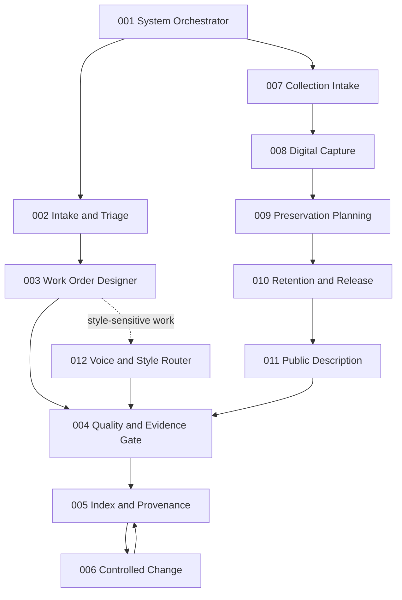

# Architecture

The system separates control work from specialist work. Each agent receives a bounded record, produces one primary artifact, and stops at an explicit handoff.

## Universal control loop

The normal control path is:

1. Agent 001 selects a route and gate.
2. Agent 002 turns raw material into a bounded intake card.
3. Agent 003 creates one executable work order with acceptance criteria.
4. A human or specialist performs the work.
5. Agent 004 checks the result against the order, evidence, and risk rules.
6. Agent 005 records accepted artifacts, status, version, and provenance.
7. Agent 006 proposes controlled changes when repeated evidence shows that a rule or template should change.

Not every run needs every agent. Clear, low-risk work may begin at Agent 003. Existing output may go directly to Agent 004. Agent 006 runs only when the system itself needs a change.

## Collection branch

Agents 007-011 demonstrate how a specialist branch plugs into the same control loop:

- Agent 007 identifies one physical object.
- Agent 008 controls its digital capture record.
- Agent 009 records preservation and storage planning.
- Agent 010 decides whether public preparation is allowed.
- Agent 011 writes factual public copy only after the release gate opens.

The branch returns to Agent 004 for quality review and Agent 005 for indexing. It never posts, sells, disposes of, or alters an object automatically.

## Cross-cutting style control

Agent 012 routes a writing task to a user-defined style profile. The public repository includes only a generic profile format. Personal or brand-specific profiles belong in private configuration and must not be committed.

## Design invariants

- One agent, one primary job.
- One record, one stable identifier.
- Unknown information remains unknown.
- A recommendation is not approval.
- A polished result is not automatically a correct result.
- External action requires explicit, target-specific authorization.
- Source artifacts are never silently overwritten.
- Accepted changes preserve a provenance trail and rollback path.

